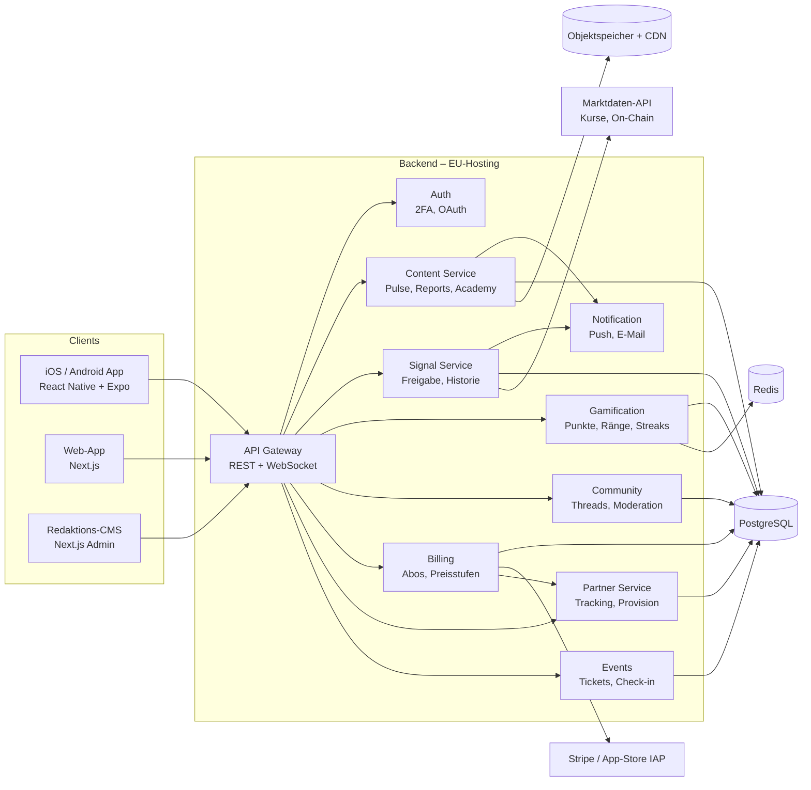
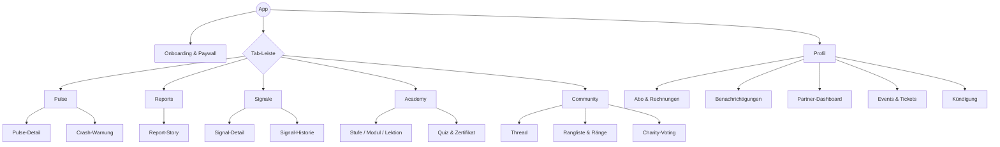
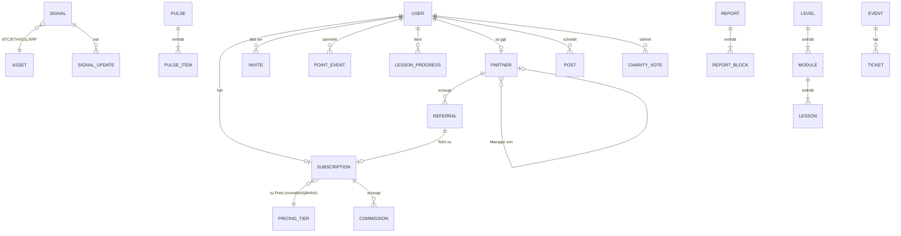

# Pflichtenheft – BEAK App

| | |
|---|---|
| **Dokument** | Pflichtenheft (Auftragnehmer-Sicht: *Wie* wird es umgesetzt) |
| **Bezug** | [Lastenheft v0.2](01-lastenheft.md) |
| **Version** | 0.2 – Entwurf (Antworten Auftraggeber eingearbeitet) |
| **Stand** | 26.09.2026 |

Jede Pflicht (PH-…) verweist auf die Lastenheft-Anforderung (LH-…), die sie erfüllt. Die Screen-IDs (S-…) verweisen auf die [Mockups](../mockups/index.html).

---

## 1. Systemüberblick

### 1.1 Technologie-Vorschlag

| Schicht | Wahl | Begründung |
|---|---|---|
| Mobile | React Native (Expo) + TypeScript | Eine Codebasis für iOS/Android, schnelle Iteration, OTA-Updates |
| Web & CMS | Next.js + TypeScript | Geteilte Komponenten und Typen mit Mobile |
| Backend | Node.js (NestJS) als modularer Monolith | Schneller Start, später in Services teilbar |
| Datenbank | PostgreSQL | Relationale Daten (Abos, Provisionen) brauchen Transaktionen |
| Cache / Leaderboards | Redis | Streaks, Ranglisten, Rate-Limits |
| Medien | S3-kompatibel + CDN | Reports mit Video/Bildern |
| Push | Firebase Cloud Messaging + APNs | Standard |
| Zahlung | Stripe (Web) + Apple/Google IAP | Siehe 6.2 |
| Hosting | EU-Region (z. B. AWS Frankfurt oder Hetzner) | DSGVO |
| Marktdaten | Kurs-API (z. B. CoinGecko/Kaiko) für BTC, ETH, SOL, XRP + On-Chain (Glassnode) | Live-Charts, Signal-Performance |

## 2. Informationsarchitektur (App)

## 3. Funktionale Pflichten

### PH-01 Onboarding & Paywall (→ LH-07, LH-10) · Screens S-01 bis S-03
| Nr. | Pflicht |
|---|---|
| PH-01.1 | Splash mit Claim „Less Noise. Better Picks.“, 3 Intro-Karten (Problem, Filter, Engine). Überspringbar. |
| PH-01.2 | Registrierung per E-Mail + Passwort, Sign in with Apple, Google. E-Mail-Verifizierung per 6-stelligem Code. |
| PH-01.3 | Kurzes Profiling (3 Fragen: Erfahrung, Interessen, bevorzugte Pulse-Uhrzeit). Ergebnis steuert Academy-Startpunkt und Push-Zeit. |
| PH-01.4 | Paywall zeigt die aktuell offene Preisstufe, echte Restplätze (aus `pricing_tier.remaining`) und die folgenden Stufen ausgegraut. |
| PH-01.4a | Umschalter **Monatlich / Jährlich**. Jährlich zeigt den Jahrespreis mit **10 % Rabatt** (z. B. 1.080 € statt 1.200 €) und den Monatswert („entspricht 90 € / Monat“). Standardauswahl: Jährlich. |
| PH-01.5 | Referral-Code wird aus Deep Link automatisch übernommen oder manuell eingegeben. |
| PH-01.6 | Pflicht-Checkboxen: AGB, Datenschutz, Risikohinweis („Keine Anlageberatung“). |

### PH-02 Daily Pulse (→ LH-01) · Screens S-04, S-05
| Nr. | Pflicht |
|---|---|
| PH-02.1 | Startscreen nach Login. Kopf: Datum, Markt-Ampel (Risk-On / Neutral / Risk-Off), Lesezeit. |
| PH-02.2 | 3–10 Themenkarten, je: Titel, 2–3 Sätze, Mini-Chart (Sparkline 24 h), Quelle, Kategorie. |
| PH-02.3 | Crash-Warnung als rote Karte ganz oben, zusätzlich eigener Push-Kanal mit hoher Priorität. |
| PH-02.4 | Push zur im Profil gewählten Uhrzeit (Standard 07:00, Europe/Berlin). |
| PH-02.5 | Fortschrittsbalken „3 Minuten“; beim Durchlesen aller Karten +10 Punkte (PH-05). |
| PH-02.6 | Archiv der letzten 30 Tage, durchsuchbar. |
| PH-02.7 | Redaktion erstellt Pulse im CMS bis 06:30, Veröffentlichung automatisch zur Zielzeit. |

### PH-03 Reports (→ LH-02) · Screens S-06, S-07
| Nr. | Pflicht |
|---|---|
| PH-03.1 | Bibliothek im Streaming-Layout: Hero-Report, Reihen nach Serie („Staffel 1: Klumpenrisiko“). |
| PH-03.2 | Report-Story als vertikaler Scroll aus Blöcken: Vollbild-Bild, Text, interaktiver Chart, Video, Zitat, „Key Takeaway“. |
| PH-03.3 | Fortschritt je Report gespeichert, „Weiterschauen“-Reihe. |
| PH-03.4 | Audio-Version (Text-to-Speech oder eingesprochen) optional je Report. |
| PH-03.5 | Kommentarbereich verknüpft mit Community (PH-05). |

### PH-04 Signale (→ LH-03) · Screens S-08, S-09, S-10
| Nr. | Pflicht |
|---|---|
| PH-04.0 | Signale gibt es nur für **BTC, ETH, SOL, XRP**. Die Asset-Liste ist im Admin pflegbar, zum Start fest auf diese vier gesetzt. Swaps nur zwischen diesen Assets. |
| PH-04.1 | Signal-Feed mit Filter (Alle / BTC / ETH / SOL / XRP) und Typ (Kauf / Swap / Hedge / Geschlossen). |
| PH-04.2 | Signalkarte: Typ-Badge, Asset, Einstieg, Zielzone, Absicherung, Zeithorizont, Status (Offen / Erreicht / Geschlossen), Begründung in 1 Satz. |
| PH-04.3 | Detail: Chart mit eingezeichneten Zonen, „Warum?“ (max. 280 Zeichen), „Was, wenn es fällt?“ (Hedge-Erklärung), Risikohinweis. |
| PH-04.4 | **Der Admin gibt Signale im Backend ein** (Formular: Asset, Typ, Einstieg, Ziel, Absicherung, Horizont, Begründung) und veröffentlicht sie. Push geht sofort nach Veröffentlichung raus. Optional (empfohlen, per Schalter): Vier-Augen-Prinzip, ein zweiter Admin gibt frei. |
| PH-04.5 | Historie öffentlich im Mitgliederbereich: alle Signale seit Start, Ergebnis in %, Trefferquote, keine nachträgliche Löschung (Audit-Log). |
| PH-04.6 | Signale sind nicht personalisiert (kein Bezug auf Portfolio des Nutzers). Siehe Lastenheft R1. |

### PH-05 Gamification nach Skool-Mechanik (→ LH-05) · Screens S-13, S-22
| Nr. | Pflicht |
|---|---|
| PH-05.1 | Punkteregeln (im Admin konfigurierbar, Startwerte): |

| Aktion | Punkte | Limit |
|---|---|---|
| Freund eingeladen, registriert sich | +25 | – |
| Eingeladener Freund schließt Abo ab | +250 | – |
| Kommentar schreiben | +2 | max. 20 Punkte / Tag |
| Beitrag schreiben | +5 | max. 25 Punkte / Tag |
| Like auf eigenen Beitrag/Kommentar erhalten | +1 | – |
| Täglich einloggen | +5 | 1× / Tag |
| Daily Pulse komplett gelesen | +10 | 1× / Tag |
| Lektion abgeschlossen | +20 | – |
| Quiz bestanden | +50 | 1× je Quiz |

| Nr. | Pflicht |
|---|---|
| PH-05.2 | Ränge: Küken (0), Beobachter (500), Stratege (2.000), Experte (6.000), Legende (15.000). Rangabzeichen erscheint neben dem Namen, wie Level bei Skool. |
| PH-05.3 | Rangliste mit Zeiträumen 7 Tage / 30 Tage / gesamt; eigener Platz immer sichtbar. |
| PH-05.4 | Ränge schalten Inhalte frei (z. B. „Experte“ → exklusive Module und Experten-Kanal). |
| PH-05.5 | Streak-Zähler (Tage in Folge mit Login), Streak-Schutz 1× pro Monat. |
| PH-05.6 | Einladen: Jedes Mitglied hat einen persönlichen Einladungslink (unabhängig vom Partner-Programm). Punkte gibt es nur für echte, verifizierte Registrierungen. |
| PH-05.7 | Missbrauchsschutz: Tageslimits, keine Punkte für Likes von eigenen Einladungen in den ersten 7 Tagen, Sperre bei Fake-Accounts. |
| PH-05.8 | Punkte haben keinen Geldwert und sind nicht auszahlbar (Lastenheft R8). |
| PH-05.9 | Bei Kündigung bleiben Punkte 12 Monate gespeichert und werden bei Rückkehr wiederhergestellt. Hinweis darauf ist sachlich, nicht drohend (Lastenheft R4/R5). |

### PH-06 Academy (→ LH-04) · Screens S-11, S-12
| Nr. | Pflicht |
|---|---|
| PH-06.1 | Drei Stufen als Schloss-Treppe; Stufe n+1 entsperrt sich nach bestandenem Abschlussquiz von Stufe n (≥ 80 %). |
| PH-06.2 | Stufe → Module → Lektionen (Video ≤ 8 min, Text, Mini-Quiz). |
| PH-06.3 | Fortschritt in %, „Nächste Lektion“ als Hauptaktion. |
| PH-06.4 | Zertifikat als PDF je Stufe (Name, Datum, Stufe, Prüf-ID). |
| PH-06.5 | Ausgestaltung abhängig von FernUSG-Prüfung (Lastenheft R3). |

### PH-07 Community (→ LH-05) · Screen S-14
| Nr. | Pflicht |
|---|---|
| PH-07.0 | Community ist **Eigenentwicklung in der App** (keine Skool-Anbindung), gleiche Mechanik wie Skool. |
| PH-07.1 | Kanäle: Allgemein, Signale (BTC/ETH/SOL/XRP), Academy-Fragen, Makro, Experten (ab Rang). |
| PH-07.2 | Beiträge mit Text, Bild, Chart-Screenshot; Likes; Antworten (1 Ebene). |
| PH-07.3 | Melden, Moderations-Queue, Sperren; Wortfilter für Scam-Links. |
| PH-07.4 | Rangabzeichen neben Namen. |

### PH-08 Charity-Voting (→ LH-06) · Screen S-15
| Nr. | Pflicht |
|---|---|
| PH-08.1 | Quartalsweise 3–5 Projekte zur Wahl, 1 Stimme pro Mitglied. |
| PH-08.2 | Anzeige Topf (2 % des Nettoumsatzes des Quartals), Zwischenstand, nach Abschluss Spendennachweis. |

### PH-09 Partner-Programm (→ LH-08) · Screen S-16
| Nr. | Pflicht |
|---|---|
| PH-09.1 | Partner-Antrag in der App, Freigabe durch Admin. Kein kostenpflichtiger Einstieg. Unterschied zum Einladen (PH-05.6): Mitglieder bekommen Punkte, freigeschaltete Partner bekommen Geld-Provision. |
| PH-09.2 | Persönlicher Link + Code, QR-Code für Events. Attribution: Last Click, 30 Tage Cookie/Deep Link. |
| PH-09.3 | Dashboard: Klicks, Registrierungen, Abschlüsse, aktive Abos, Provision (offen / ausgezahlt). |
| PH-09.4 | Provision nur auf bezahlte Endkunden-Abos. Manager-Overhead (5–10 %) aus Umsätzen des Teams, nie aus Partner-Anwerbung (Lastenheft R2). |
| PH-09.5 | Auszahlung monatlich per SEPA nach Ablauf des Widerrufsrechts (14 Tage); Gutschrift als PDF. |

### PH-10 Events (→ LH-09) · Screens S-17, S-18
| Nr. | Pflicht |
|---|---|
| PH-10.1 | Partner-Manager legt Event an (Titel, Ort, Datum, Kapazität, Agenda). Admin-Freigabe. |
| PH-10.2 | Öffentliche Eventseite (Web) mit Anmeldung ohne App-Konto (Name, E-Mail). |
| PH-10.3 | Ticket mit QR-Code in App/Wallet; Check-in über Scanner in der Manager-Ansicht. |
| PH-10.4 | Teilnehmer werden dem veranstaltenden Partner zugeordnet (Attribution). |

### PH-11 Profil & Konto (→ LH-10) · Screens S-19, S-20
| Nr. | Pflicht |
|---|---|
| PH-11.1 | Profil: Avatar, Rang, Punkte, Streak, Zertifikate. |
| PH-11.2 | Benachrichtigungen einzeln schaltbar: Pulse, Crash-Warnung, Signale, Community, Events. |
| PH-11.3 | Abo: Preisstufe, Zahlweise (monatlich/jährlich), nächste Abbuchung, Rechnungen (PDF), Zahlungsmittel. Wechsel auf jährlich mit Anzeige der Ersparnis (10 %). |
| PH-11.4 | Button „Abo kündigen“ → Bestätigungsseite mit Enddatum → Bestätigung per E-Mail (§ 312k BGB). Höchstens eine sachliche Info zum Punkte-Erhalt, keine Pflicht-Umfrage. |
| PH-11.5 | Datenexport und Konto löschen (DSGVO Art. 15, 17, 20). |

### PH-12 CMS & Admin (→ LH-11) · Screen S-21
| Nr. | Pflicht |
|---|---|
| PH-12.1 | Rollen: Admin (inkl. Signale eingeben), Redakteur, Moderator, Partner-Manager. |
| PH-12.2 | Editor mit Blöcken für Pulse/Reports, Vorschau im App-Layout, Zeitplanung. |
| PH-12.3 | Signal-Workflow: Entwurf → (optional Prüfung durch zweiten Admin) → Veröffentlicht → Geschlossen; Audit-Log. |
| PH-12.4 | Preisstufen verwalten (Monatspreis, Jahresrabatt in %, Kontingent, aktiv). |
| PH-12.4a | Punkteregeln und Tageslimits verwalten (PH-05.1). |
| PH-12.5 | KPIs: aktive Mitglieder, DAU/MAU, Churn, Pulse-Öffnungsrate, Umsatz, Provisionen. |

## 4. Datenmodell (Kern)

## 5. Schnittstellen (Auszug REST)

| Methode | Pfad | Zweck |
|---|---|---|
| GET | `/v1/pulse/today` | Heutiger Pulse inkl. Items |
| GET | `/v1/reports?series=` | Report-Bibliothek |
| GET | `/v1/signals?status=open&type=hedge&asset=BTC` | Signal-Feed |
| GET | `/v1/signals/{id}` | Signal-Detail inkl. Updates |
| GET | `/v1/academy/levels` | Stufen mit Sperrstatus und Fortschritt |
| POST | `/v1/academy/lessons/{id}/complete` | Lektion abschließen (+Punkte) |
| GET | `/v1/me/gamification` | Punkte, Rang, Streak |
| POST | `/v1/billing/checkout` | Checkout-Session für aktuelle Preisstufe, `interval=month|year` |
| GET | `/v1/leaderboard?period=7d|30d|all` | Rangliste |
| GET | `/v1/me/invite` | Persönlicher Einladungslink und Einladungs-Punkte |
| POST | `/v1/billing/cancel` | Kündigung |
| GET | `/v1/partner/dashboard` | Partner-Kennzahlen |
| POST | `/v1/events/{id}/tickets` | Anmeldung |
| WS | `/v1/stream` | Live-Kurse, neue Signale |

## 6. Querschnitt

### 6.1 Sicherheit
- OAuth 2.0 / OIDC, Access-Token 15 min, Refresh-Token rotierend; TOTP-2FA.
- Rate-Limits, Bot-Schutz bei Registrierung.
- Signale werden erst nach Freigabe an Clients ausgeliefert (kein Vorab-Leak über API).
- Penetrationstest vor Launch.

### 6.2 Zahlung
Empfehlung: Abschluss über **Web-Checkout (Stripe)**, App ist „Reader“-App mit Login. Bei bis zu 5.400 €/Jahr wären 15–30 % Store-Gebühr erheblich. Seit dem DMA (EU) und US-Urteilen zu Anti-Steering sind Hinweise auf externe Zahlung in vielen Regionen möglich; Details vor Umsetzung prüfen. Fallback: IAP für Monatsabo. Stripe bildet beide Zahlweisen (monatlich, jährlich mit 10 % Rabatt) als zwei Preise je Stufe ab.

### 6.3 Datenschutz
- EU-Hosting, AV-Verträge mit allen Dienstleistern.
- Tracking nur nach Einwilligung (TTDSG/CMP).
- Partner sehen keine personenbezogenen Daten ihrer Empfehlungen außer Vorname und Status.

### 6.4 Qualitätssicherung
- Unit- und Integrationstests (Billing, Provision, Punkte: 100 % der Regeln abgedeckt).
- E2E-Tests der Kernpfade (Onboarding → Abo → Pulse; Signal-Freigabe → Push; Kündigung).
- Beta über TestFlight / Play Internal mit den ersten 100 Mitgliedern.

## 7. Budget und Release-Plan

Der Auftraggeber nennt **127.000 €** oder **227.000 €**. Beide Varianten, Schätzung auf Basis eines gemischten Tagessatzes von ca. 800 €:

### Variante A – 127.000 € („Launch-MVP“, ca. 5 Monate)

| Paket | Inhalt | Kosten |
|---|---|---|
| Konzept & Design | UX, UI-Designsystem, Klick-Prototyp | 15.000 € |
| Backend & Admin | Auth/2FA, Abo (monatlich/jährlich, Stripe), Preisstufen, Signal-Eingabe, Daily Pulse, Push | 42.000 € |
| App iOS + Android | Onboarding, Paywall, Pulse, Signale, Profil, Kündigung | 38.000 € |
| Community & Gamification | Kanäle, Beiträge, Kommentare, Likes, Punkte, Ränge, Rangliste, Einladen | 20.000 € |
| QA & Release | Tests, Sicherheits-Check, Store-Einreichung | 8.000 € |
| Projektleitung / Puffer | | 4.000 € |
| **Summe** | | **127.000 €** |

Später aus Umsätzen: Academy, Reports-Storyformat, Partner-Programm, Events, Charity-Voting, Web-App.

### Variante B – 227.000 € („Volle Engine“, ca. 8 Monate)

| Paket | Kosten |
|---|---|
| Alles aus Variante A | 127.000 € |
| Academy (3 Stufen, Lektionen, Quiz, Zertifikat) | 28.000 € |
| Reports im Storyformat inkl. Video/CDN | 18.000 € |
| Partner-Programm + Events (Provision, Tickets, QR-Check-in) | 30.000 € |
| Charity-Voting | 4.000 € |
| Web-App (Next.js) | 12.000 € |
| Zusätzliche QA / Projektleitung | 8.000 € |
| **Summe** | **227.000 €** |

### Nicht im Budget
- Rechtsberatung (R1–R3, R8): grob 8.000–20.000 €
- Laufender Betrieb: Hosting, Marktdaten-API, Push, E-Mail ca. 800–2.000 € / Monat
- Wartung & Weiterentwicklung: üblich 15–20 % der Entwicklungskosten pro Jahr
- Inhalte (Redaktion, Signale) und Marketing

### Phasen

| Phase | Variante A | Variante B |
|---|---|---|
| 0 – Klärung & Design | Rechtsprüfung, Designsystem, Prototyp (4 Wo.) | gleich (5 Wo.) |
| 1 – MVP | Onboarding, Abo, Pulse, Signale, Profil, Admin (10 Wo.) | gleich (10 Wo.) |
| 2 – Community | Community + Punkte + Rangliste + Einladen (5 Wo.) | gleich + Academy (8 Wo.) |
| 3 – Wachstum | – | Partner, Events, Reports, Charity, Web (8 Wo.) |
| Beta & Launch | mit den ersten 100 Mitgliedern (2 Wo.) | gleich (3 Wo.) |

## 8. Abnahme

Abnahme je Phase gegen die Kriterien in Lastenheft Kap. 8 sowie die jeweiligen PH-Nummern. Abnahmeprotokoll mit Testfällen je PH-Nummer.
