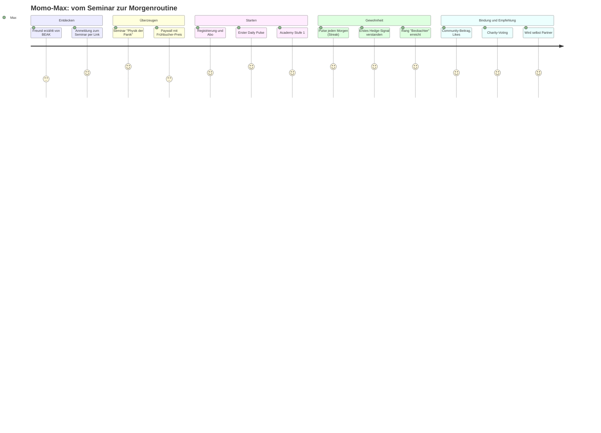

# Customer Journey – BEAK App

| | |
|---|---|
| **Version** | 0.1 – Entwurf |
| **Stand** | 25.09.2026 |
| **Bezug** | [Lastenheft](01-lastenheft.md) · [Pflichtenheft](02-pflichtenheft.md) · [Mockups](../mockups/index.html) |

---

## 1. Personas

### Persona A – „Momo-Max“, der Einsteiger
- 29, Angestellter im Vertrieb, 8.000 € in Krypto, davon 3.000 € im Minus.
- Kauft nach TikTok-Tipps, verkauft in Panik. Hat Stop-Losses „ausgestoppt“ bekommen.
- **Braucht:** Orientierung, Sicherheit beim Setup, eine Routine statt Bauchgefühl.
- **Kommt über:** Freund (Partner) → Offline-Seminar.

### Persona B – „Macherin Mira“, die Zeitknappe
- 41, Unternehmerin, 250.000 € Vermögen, davon 15 % Krypto, Rest ETF/Gold.
- Liest FT, hat aber keine Zeit. Will wissen, was nachts passiert ist, und sich absichern.
- **Braucht:** 3-Minuten-Überblick, klare Hedging-Signale, Makro-Kontext.
- **Kommt über:** Empfehlung im Unternehmer-Netzwerk → Web-Paywall.

### Persona C – „Gorilla Gerd“, der Partner-Manager
- 47, Finanzcoach mit eigenem Netzwerk, hostet Seminare.
- **Braucht:** Einfaches Event-Tool, Link-Tracking, transparente Provision.

## 2. Journey-Überblick

## 3. Phasen im Detail

Legende Emotion: 😟 negativ · 😐 neutral · 🙂 positiv

### Phase 1 – Entdecken (Awareness)

| | |
|---|---|
| **Touchpoints** | Empfehlung durch Partner, Social Clip (Jenga-Turm-Visual), Event-Einladung (S-17) |
| **Nutzer tut** | Klickt Partner-Link, sieht Eventseite, meldet sich mit Name und E-Mail an |
| **Nutzer denkt** | „Schon wieder ein Krypto-Guru?“ |
| **Emotion** | 😐 skeptisch |
| **Schmerzpunkt** | Misstrauen gegenüber Finanz-Influencern |
| **Chance** | Seminar ist ausdrücklich neutral und bildend, kein Verkaufsdruck; Referenzen, echte Signal-Historie öffentlich zeigen |
| **Funktionen** | PH-09.2 Partner-Link, PH-10.2 Eventseite |

### Phase 2 – Überzeugen (Consideration)

| | |
|---|---|
| **Touchpoints** | Offline-Seminar, Ticket-QR (S-18), Paywall (S-03) |
| **Nutzer tut** | Erlebt „Physik der Panik“ live, scannt QR, sieht Preisstufe mit Restplätzen |
| **Nutzer denkt** | „Das erste Mal, dass mir das jemand einfach erklärt.“ / „100 € im Monat ist viel.“ |
| **Emotion** | 🙂 → 😐 |
| **Schmerzpunkt** | Preis, Angst vor Abo-Falle |
| **Chance** | Kündigung jederzeit sichtbar kommunizieren; Preisgarantie erklären; Vorschau auf einen echten Pulse |
| **Funktionen** | PH-01.4 Paywall, PH-01.5 Referral |

### Phase 3 – Starten (Onboarding)

| | |
|---|---|
| **Touchpoints** | Registrierung (S-02), Profiling, erster Pulse (S-04), Academy (S-11) |
| **Nutzer tut** | Registriert sich mit Apple, beantwortet 3 Fragen, wählt 07:00 als Pulse-Zeit, liest ersten Pulse, startet Lektion 1 |
| **Nutzer denkt** | „Okay, das ist tatsächlich in 3 Minuten durch.“ |
| **Emotion** | 🙂 |
| **Schmerzpunkt** | Zu viele Funktionen auf einmal |
| **Chance** | Geführter erster Tag: nur Pulse + 1 Lektion, Rest schrittweise freischalten |
| **Funktionen** | PH-01.2/3, PH-02, PH-06 |

### Phase 4 – Gewohnheit (Habit)

| | |
|---|---|
| **Touchpoints** | Push 07:00, Daily Pulse, Signal-Push, Streak-Anzeige (S-13) |
| **Nutzer tut** | Öffnet täglich die App, liest Pulse, sieht erstes Hedge-Signal, versteht „Was, wenn es fällt?“ |
| **Nutzer denkt** | „Früher hätte ich jetzt panisch verkauft.“ |
| **Emotion** | 🙂 |
| **Schmerzpunkt** | Signal läuft gegen ihn → Enttäuschung |
| **Chance** | Transparente Historie, Erklärung der Absicherung; Community-Thread zum Signal |
| **Funktionen** | PH-02.4, PH-04, PH-05.3 |

### Phase 5 – Bindung (Retention)

| | |
|---|---|
| **Touchpoints** | Rangaufstieg, Academy Stufe 2/3, Community (S-14), Charity-Voting (S-15), Reports (S-06) |
| **Nutzer tut** | Erreicht „Stratege“, schreibt Beiträge, stimmt für Spendenprojekt ab, schaut Report-Serie |
| **Nutzer denkt** | „Das ist mein Ort für Finanzen.“ |
| **Emotion** | 🙂 |
| **Schmerzpunkt** | Content-Müdigkeit nach 6–9 Monaten |
| **Chance** | Neue Report-Staffeln, Experten-Kanal ab Rang, Jahresrückblick („Dein BEAK-Jahr“) |
| **Funktionen** | PH-03, PH-05, PH-07, PH-08 |

### Phase 6 – Empfehlen (Advocacy)

| | |
|---|---|
| **Touchpoints** | Partner-Antrag, Partner-Dashboard (S-16), Event anlegen |
| **Nutzer tut** | Teilt Link mit Freunden, wird Partner, später Manager mit eigenem Seminar |
| **Nutzer denkt** | „Wenn es mir geholfen hat, hilft es auch meinem Bruder.“ |
| **Emotion** | 🙂 |
| **Schmerzpunkt** | Unklare Provisionsabrechnung |
| **Chance** | Echtzeit-Dashboard, klare Regeln, monatliche Gutschrift |
| **Funktionen** | PH-09, PH-10 |

### Phase 7 – Kündigung / Rückkehr (Exit & Win-back)

| | |
|---|---|
| **Touchpoints** | Profil → Abo (S-19), Kündigung (S-20), E-Mail |
| **Nutzer tut** | Kündigt in 2 Schritten, erhält Bestätigung |
| **Nutzer denkt** | „Fair, das ging einfach.“ |
| **Emotion** | 😐 |
| **Chance** | Punkte 12 Monate gespeichert; ehrliche Rückkehr-Mail nach 60 Tagen; frühere Preisstufe nur bei ununterbrochenem Abo (klar kommuniziert) |
| **Funktionen** | PH-05.5, PH-11.4 |

## 4. Mira – der Tag mit BEAK (Service-Blueprint, verkürzt)

| Zeit | Nutzerin | App (Frontstage) | Backend / Team (Backstage) |
|---|---|---|---|
| 06:30 | schläft | – | Redaktion schließt Pulse im CMS ab, Freigabe |
| 07:00 | Wecker, greift zum Handy | Push „Dein Pulse: 5 Themen, 3 min“ | Notification Service versendet nach Zeitzone |
| 07:02 | liest Pulse | Markt-Ampel „Risk-Off“, Karte „Anleihen-Stress Japan“ | Live-Charts aus Marktdaten-API |
| 11:40 | Meeting | Push „Neues Hedge-Signal: BTC“ | Analyst erstellt, Freigeber prüft (4 Augen) |
| 12:15 | Mittagspause | Signal-Detail, „Was, wenn es fällt?“ | Signal im Audit-Log |
| 21:00 | Sofa | Report-Folge „Klumpenrisiko S&P 500“ | CDN liefert Video |
| 21:20 | kommentiert | Community-Thread | Moderation, +15 Punkte bei 3 Likes |

## 5. Moments of Truth

1. **Erster Pulse:** Muss in 3 Minuten verständlich sein, sonst kein Habit.
2. **Erstes Signal, das gegen den Nutzer läuft:** Hier entscheidet die Erklärung der Absicherung über Vertrauen.
3. **Kündigung:** Einfach und fair. Das schützt Marke und Weiterempfehlung.
